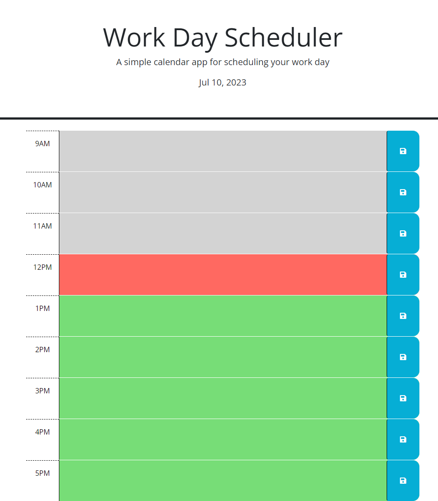

# work-planner
Simple Work day planner


## Description
Main Topic: Day.js (Javascript Library)

Given some starter code this app is a simple work day planner that will allow a user to plan out their work day. This app uses Jquery to dynamically change the time block elements on the page to correspond to the current time of day. Also with the use of local storage, appointments are able to be saved with the use of a save button.


## Screenshot



## Link
[Click here](https://johnfoxwell.github.io/work-planner/)


## Developed by:
```
John Foxwell
```


